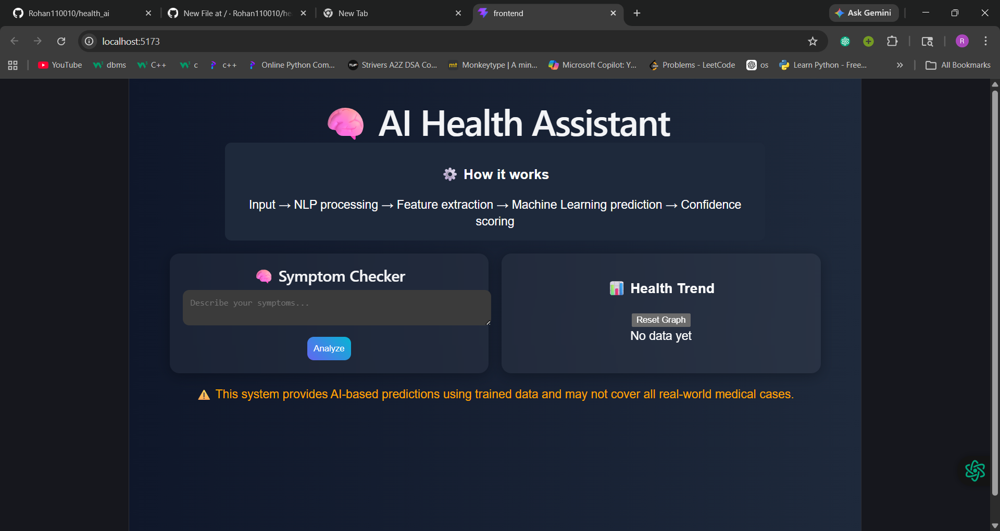
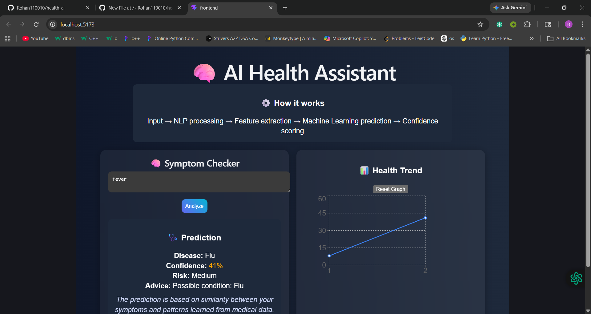

# 🧠 AI Health Assistant

An AI-powered web app that predicts possible diseases from user symptoms and visualizes health trends.

## 🚀 Features
- Symptom-based disease prediction (ML)
- Dynamic confidence & risk levels
- Real-time health trend graph
- Full-stack (React + FastAPI)

## 🛠 Tech Stack
- Frontend: React, Recharts
- Backend: FastAPI (Python)
- ML: scikit-learn (RandomForest)

## ⚙️ Setup

### Backend
cd backend
python -m venv venv
venv\Scripts\activate
pip install -r requirements.txt
uvicorn main:app --reload

### Frontend
cd frontend
npm install
npm run dev

## 📸 Screenshots
### 🧠 Main UI

### 🔍 Prediction

### 📊 Graph

## 📌 Disclaimer
This is a prototype and not a medical diagnostic tool.
